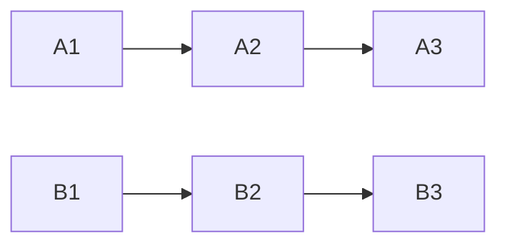
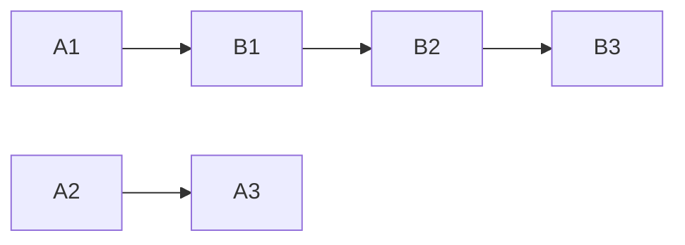
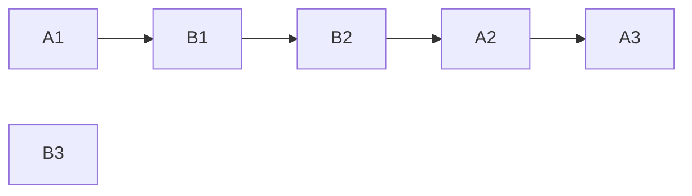
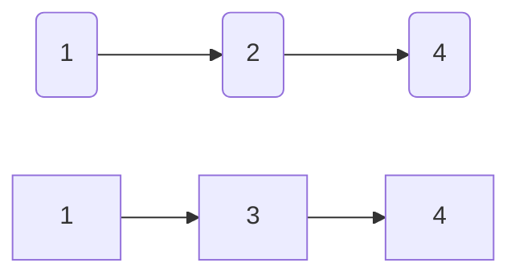
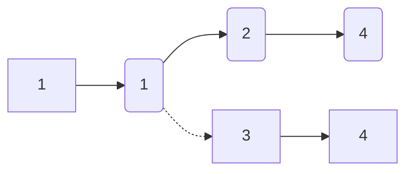
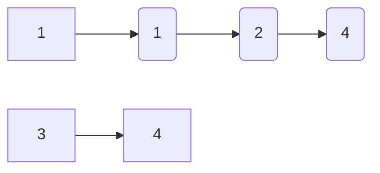
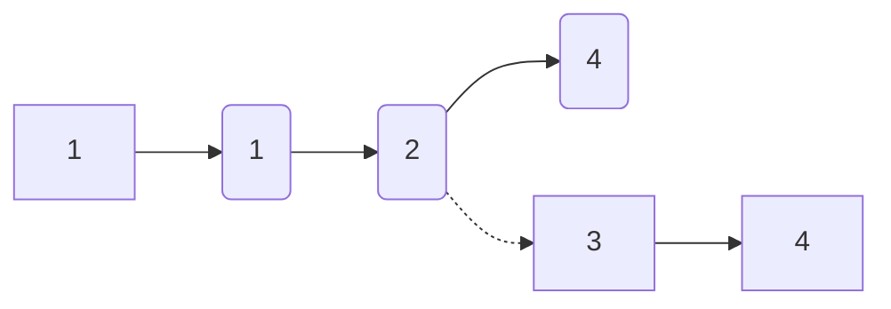
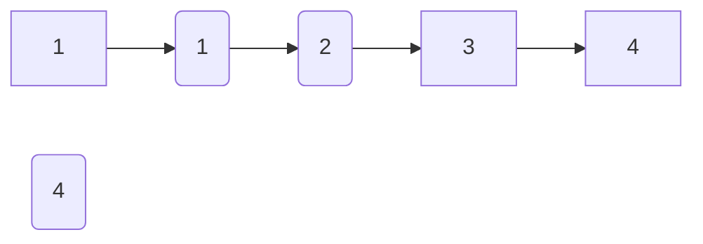
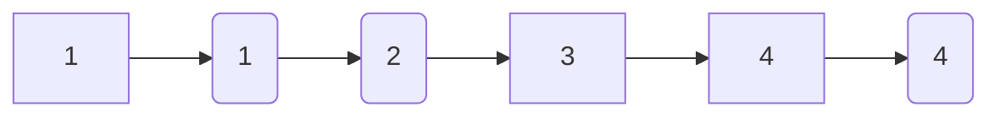

# LeetCode:21:20220107:Go

tags: #problem_solve #leetcode/easy #golang #linked_list

[Reference](https://leetcode.com/problems/merge-two-sorted-lists/)

## Question

You are given the heads of two sorted linked lists `list1` and `list2`.

Merge the two lists in a one **sorted** list. The list should be made by splicing together the nodes of the first two lists.

Return *the head of the merged linked list*.

**Example 1:**


```
Input: list1 = [1,2,4], list2 = [1,3,4]
Output: [1,1,2,3,4,4]
```

**Example 2:**

```
Input: list1 = [], list2 = []
Output: []
```

**Example 3:**

```
Input: list1 = [], list2 = [0]
Output: [0]
```

**Constraints:**

- The number of nodes in both lists is in the range `[0, 50]`.
- `-100 <= Node.val <= 100`
- Both `list1` and `list2` are sorted in **non-decreasing** order.

## My Solution

本來是不想記Easy題目的，但解題過程中發現這題其實沒有最初想的那麼簡單，由於對Linked list的結構以及指標熟悉度不足，反而寫起來比Array還累。

首先來快速回憶一下Linked list的結構

```go
type ListNode struct{
    Val int
    Next *ListNode
}
```

假如我有兩串Linked List :A, B



現在先不管裡面的Val，假如我要將A1指向B1



就會遺失A2的位置，所以必須再多建立一個變數去存A2的位置

同理，如果要把B2指向A2



就會遺失B3的位置

---

OK，結束回憶回來看題目

首先排除再建立一條新的linked list來存答案的做法，因為這麼做就完全沒用到linked list的好處

也就是所有的節點都來自於輸入的兩條linked list，我就是把他們箭頭指向正確的節點罷了

以題目範例來看(兩條形狀不一樣方便辨識)



假如我用的邏輯是

```go
if list1.Val < list2.Val {
  //...
} else {
  //...
}
```

也就是兩邊相等的話取第二條(為方便第一條稱為A第二條稱為B)

第一點我取B1，第一點的位置要記起來最後回傳

第二點取A1，這時要把B1原本指向的B2位置記起來





第三點取A2，原本就是正確的不需要動

第四點取B2，把斷線的A3位置記起來





再來選B3不用動

接著選A3



確認輸入的兩條linked list再接下去都是`null`/`nil`，搞定收工，回傳最初第一點的位置

---

流程整理完，該是時候把它實現出來了

```go
func mergeTwoLists(list1 *ListNode, list2 *ListNode) *ListNode {
	// edge cases
	if list1 == nil {
		return list2
	}
	if list2 == nil {
		return list1
	}

	// pick first node
	var firstNode, restNode *ListNode
	if list1.Val < list2.Val {
		firstNode = list1
		restNode = list2
	} else {
		firstNode = list2
		restNode = list1
	}

	currentNode := firstNode
	for restNode != nil {
		if currentNode.Next == nil {
			temp := currentNode.Next
			currentNode.Next = restNode
			restNode = temp
		} else if restNode.Val < currentNode.Next.Val {
			temp := currentNode.Next
			currentNode.Next = restNode
			restNode = temp
		}
		currentNode = currentNode.Next
	}

	return firstNode
}
```

結果評價

> Runtime: 4 ms, faster than 20.30% of Go online submissions for Merge Two Sorted Lists.
>
> Memory Usage: 2.7 MB, less than 18.69% of Go online submissions for Merge Two Sorted Lists.

大概輸給八成的golang答案，慘

## Better Solutions

### Solution 1

```java
public ListNode mergeTwoLists(ListNode l1, ListNode l2){
		if(l1 == null) return l2;
		if(l2 == null) return l1;
		if(l1.val < l2.val){
			l1.next = mergeTwoLists(l1.next, l2);
			return l1;
		} else{
			l2.next = mergeTwoLists(l1, l2.next);
			return l2;
		}
}
```

java 1ms solution

edge case 的處理方式和我一樣

下面的遞迴就真的很精彩。

### Solution 2

```C++
class Solution {
public:
    ListNode *mergeTwoLists(ListNode *l1, ListNode *l2) {
        ListNode dummy(INT_MIN);
        ListNode *tail = &dummy;
        
        while (l1 && l2) {
            if (l1->val < l2->val) {
                tail->next = l1;
                l1 = l1->next;
            } else {
                tail->next = l2;
                l2 = l2->next;
            }
            tail = tail->next;
        }

        tail->next = l1 ? l1 : l2;
        return dummy.next;
    }
};
```

建立一個新節點作為第一點，回傳的時候回它的next(真正的第一點)，還順便解決了edge cases (因為dummy.next會是`null`)

看起來除此之外和我的作法並沒有太大的差別，但為啥他就比較快?
