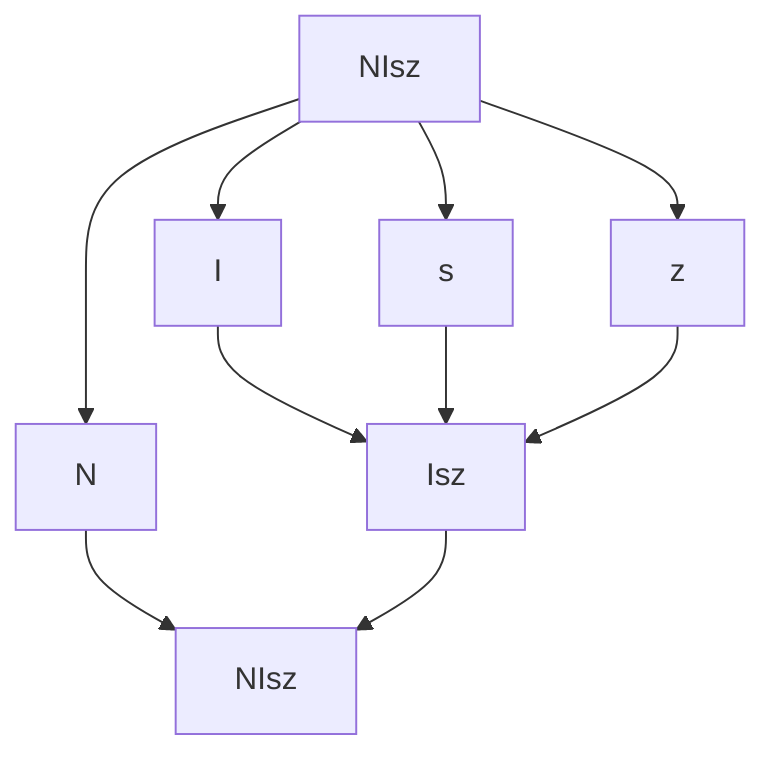

# Uva:271:20220630:?

[Reference](https://onlinejudge.org/external/2/271.pdf)


## Question

In the land of Hedonia the official language is Hedonian. A Hedonian professor had noticed that many of her students still did not master the syntax of Hedonian well. Tired of correcting the many syntactical mistakes, she decided to challenge the students and asked them to write a program that could check the syntactical correctness of any sentence they wrote. Similar to the nature of Hedonians, the syntax of Hedonian is also pleasantly simple. Here are the rules:


0. The only characters in the language are the characters ‘p’ through ‘z’ and ‘N’, ‘C’, ‘D’, ‘E’, and ‘I’. 

1. Every character from ‘p’ through ‘z’ is a correct sentence. 

2. If s is a correct sentence, then so is Ns.

3. If s and t are correct sentences, then so are Cst, Dst, Est and Ist.

4. Rules 0. to 3. are the only rules to determine the syntactical correctness of a sentence. 

You are asked to write a program that checks if sentences satisfy the syntax rules given in Rule 0. - Rule 4.


### Input

The input consists of a number of sentences consisting only of characters ‘p’ through ‘z’ and ‘N’, ‘C’, ‘D’, ‘E’, and ‘I’. Each sentence is ended by a new-line character. The collection of sentences is terminated by the end-of-file character. If necessary, you may assume that each sentence has at most 256 characters and at least 1 character.


### Output

The output consists of the answers ‘YES’ for each well-formed sentence and ‘NO’ for each not-wellformed sentence. The answers are given in the same order as the sentences. Each answer is followed by a new-line character, and the list of answers is followed by an end-of-file character.


### Sample Input

Cp

Isz 

NIsz 

Cqpq

### Sample Output

NO 

YES 

YES 

NO

## My Solution

先理解一下題目

從Sample看起

1. Cp
   * 根據規則1，p符合[p-z] 算是一個sentence
   * 根據規則3，C前面必須有兩個sentences，所以不符合文法
2. Isz
   * 根據規則1 z算是一個sentence
   * 根據規則1 s算是一個sentence
   * 根據規則3 Isz算是一個sentence
3. NIsz
   * 根據上一個Sample Isz算是一個sentence
   * 根據規則2 NIsz算是一個sentence
4. Cqpq
   * 根據規則1 q p q分別算是sentences
   * 根據規則3 Cqp算是一個sentence
   * 最後一共有兩個sentences `Cqp` `q`，所以不符合文法


應該是這樣吧。


拿NIsz來舉例，解法大概如下




用Stack實作

```go
func Uva271(str string) bool {
	set := NewSentence(str)
	popCount := 0

	for len(set.content) != 0 {
		p := set.pop()
		if isN(p) {
			if popCount < 1 {
				return false
			}
			set.push("Ns")
			popCount--
		} else if isCDIE(p) {
			if popCount < 2 {
				return false
			}
			set.push("Its")
			popCount -= 2
		} else {
			popCount++
		}
	}
	return popCount == 1
}

type Sentence struct {
	content []string
}

func NewSentence(str string) Sentence {
	content := make([]string, len(str))
	for i := range str {
		content[i] = string(str[i])
	}
	return Sentence{content: content}
}

func (s *Sentence) push(str string) {
	s.content = append(s.content, str)
}

func (s *Sentence) pop() string {
	length := len(s.content)
	res := s.content[length-1]
	s.content = s.content[:length-1]
	return res
}

func isN(str string) bool    { return str == "N" }
func isCDIE(str string) bool { return str == "C" || str == "D" || str == "I" || str == "E" }

```

原本是打算模擬真實的情況，在stack裡面放真的sentence，寫到一半才發覺根本沒必要，所以就改用popCount來計算取出來的數量，並且丟回去的也用`Ns` `Its`來替代。


測試

```go
func main() {
	fmt.Println(Uva271("Cp"))
	fmt.Println(Uva271("Isz"))
	fmt.Println(Uva271("NIsz"))
	fmt.Println(Uva271("Cqpq"))
}
```


```text
false
true
true
false
```


## Better Solutions

