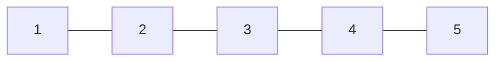
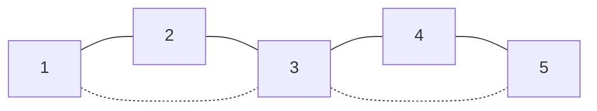
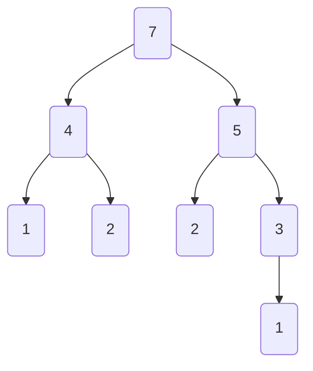
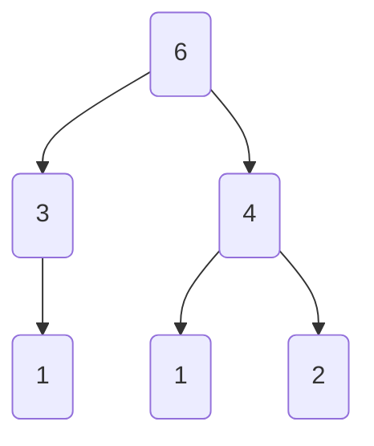

# Uva:11069:20220112:Go

[Reference](https://onlinejudge.org/external/110/11069.pdf)


## Question

### 11069 A Graph Problem

Given an undirected graph of the following form with n nodes, 1 ≤ n ≤ 76: 


Your task is to calculate the number of subsets of nodes of the graph with the following properties:

* no nodes in the subset should be connected 

* it shouldn’t be possible to add further nodes to the subset without violating the first condition 

For a graph with 5 nodes the number of subsets which fulfill the above conditions is 4. The subsets are {1,3,5},{2,4},{2,5},{1,4}. 

**Input** 

The input will consist of a sequence of numbers n, 1 ≤ n ≤ 76. Each number will be on a separate line. The input will be terminated by EOF.

**Output** 

Output the number of subsets as described above on a single line. The number of all subsets will be less than 2^31 . 

**Sample Input** 

1 

2 

3 

4 

5 

30 

**Sample Output** 

1 

2 

2 

3 

4 

4410

## My Solution

重新確認一下題目範例，假如輸入n=5



接著在裡面找彼此不相連且無法擴充的子集

例如 1 3 5



求這種子集合的數量。


乍看之下找不出規律，先從簡單的case開始看

| N    | Subsets                                                      | Count |
| ---- | ------------------------------------------------------------ | ----- |
| 1    | [1]                                                          | 1     |
| 2    | [1], [2]                                                     | 2     |
| 3    | [1, 3], [2]                                                  | 2     |
| 4    | [1, 3], [2, 4], [1, 4]                                       | 3     |
| 5    | [1, 3, 5], [2, 4], [1, 4], [2, 5]                            | 4     |
| 6    | [1, 3, 5], [1, 3, 6], [2, 4, 6], [1, 4, 6], [2, 5]           | 5     |
| 7    | [1, 3, 5, 7], [1, 3, 6], [2, 4, 6], [2, 4, 7], [1, 4, 6], [1, 4, 7], [2, 5, 7] | 7     |


歸納出一些規則，不管有沒有用總之先列出來:

1. subset中兩數相差只有 2 或 3 兩種可能，再少就會相連，再多就可以插入其他數
2. 根據1 subset的起始數永遠是 1 或 2
3. 根據1 subset最後的數一定是N或N-1
4. N個節點的subsets和N-1個節點的subsets 有某種程度的關聯
   * 在N-1的subsets中，最後一點為N-1的subset，也會是N2的subset
5. 跟跨步那種類型的題目有一點相似，下面分析


假如把它想成跨步問題(忘記專有名詞了，想到再補)，從1開始走，每次只能走2~3步:

* 走到1的方法有: [1]
* 2: [2]
* 3:[1, 3], [3]
* 4:[1, 4],[2, 4]


倒過來看我要走到7一定要先走到4或5，按照這樣可以畫一個圖如下



為了配合題目，這邊忽略一次走到3的方法，可以一次走到的地方只有1或2

從上圖就可以看除 假設f(n)=走到n的走法數量，則

f(7)=f(4)+f(5)

f(4)=f(1)+f(2)

f(5)=f(2)+f(3)

f(3)=f(1)

f(2)=f(1)=1


解得f(7)=4，但題目沒這麼簡單，N=7不代表我的subset**必須**包含7，根據先前歸納的結論，subset的最後一個數也可能是N-1

那我再列出f(6)試試



得f(6)=3

回到題目:當N=7時，我的subsets數量會等於 f(7) + f(6) = 7


到這邊不知不覺就把題目解出來了，接著就是實作這個邏輯

```go
func uva11069(n int) int {
	return getSteps(n) + getSteps(n-1)
}

func getSteps(n int) int {
	if n == 0 {
		return 0
	}
	if n <= 2 {
		return 1
	}
	return getSteps(n-3) + getSteps(n-2)
}
```

經過測試應該是正確的解法，不過在go playground 跑 N = 100 時會發生timeout

試著再稍微提升點效率，把已經計算過的內容記下來重複使用

```go
var getStepsResults map[int]int

func uva11069(n int) int {
	getStepsResults = make(map[int]int)
	return getSteps(n) + getSteps(n-1)
}

func getSteps(n int) int {
	if val, ok := getStepsResults[n]; ok {
		return val
	}

	if n == 0 {
		getStepsResults[n] = 0
		return 0
	}
	if n <= 2 {
		getStepsResults[n] = 1
		return 1
	}

	res := getSteps(n-3) + getSteps(n-2)
	getStepsResults[n] = res
	return res
}

```

改完就可以算到100了

連1000都可以算出來不過會因為溢位變成負值


## Better Solutions

[來源](http://programming-study-notes.blogspot.com/2013/12/uva-11069-graph-problem.html)

```C++

#include <cstdio>
using namespace std;
int main()
{
    int ans[77];
    ans[1]=1;
    ans[2]=2;
    ans[3]=2;
    for(int i=4;i<=76;i++)
        ans[i]=ans[i-2]+ans[i-3];

    int n;
    while(scanf("%d",&n)!=EOF)
        printf("%d\n",ans[n]);

    return 0;
}
```


和我類似作法，不過他沒有把問題變成跨步問題來解，而是直接找到題目的規律

另外直接把所有答案全算出來，話說我在解題的時候完全忘記了題目有說"1<=n<=76"還去測試n=100的情形ww

另外int array其實在這題裡面就足以替代map[int]int了，沒必要做額外的map，這點倒是很值得參考
