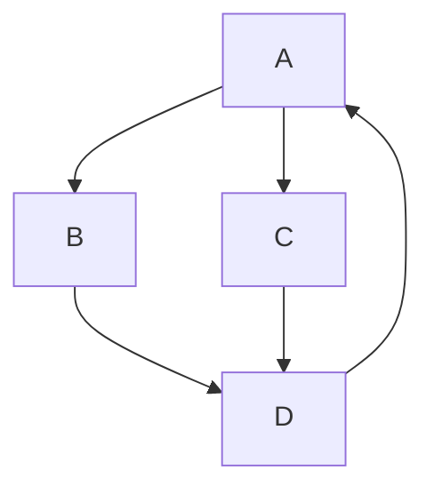

# Directed Graph Cycle Detection

tags: #algorithms #cycle_detection #DFS #graph #directed_graph #tarjan_algoritm

## References

- [geeksforgeeks](https://www.geeksforgeeks.org/detect-cycle-in-a-graph/)
- chatGPT

## Directed Graph

A **directed graph** (also known as a [[Graph]]) consists of a set of vertices (nodes) connected by directed edges (arcs). Each edge has a specific direction, indicating the flow from one vertex to another. In other words, the connections between nodes have a defined start and end point.

To illustrate, consider the following directed graph:



In this example, we have four vertices (A, B, C, and D) and five directed edges connecting them.

## Cycles in Directed Graphs

A **cycle** in a directed graph is a path that starts and ends at the same vertex, while passing through other vertices in between. In simpler terms, it is a sequence of vertices and edges that forms a closed loop within the graph.

For instance, in the previous example, the directed graph contains a cycle: A -> B -> D -> A. This cycle starts and ends at vertex A, passing through vertices B and D.

## Cycle Detection Algorithms

### Depth-First Search (DFS)

[[Depth-First Search]] is a graph traversal algorithm that can be used to detect cycles in directed graphs. The idea behind DFS is to explore the graph by visiting vertices and recursively exploring their adjacent vertices.

Here is a simplified example of a DFS-based cycle detection algorithm implemented in Go:

```go
func hasCycleDFS(graph map[string][]string, node string, visited map[string]bool, recursionStack map[string]bool) bool {
	visited[node] = true
	recursionStack[node] = true

	for _, neighbor := range graph[node] {
		if !visited[neighbor] {
			if hasCycleDFS(graph, neighbor, visited, recursionStack) {
				return true
			}
		} else if recursionStack[neighbor] {
			return true
		}
	}

	recursionStack[node] = false
	return false
}

func hasCycle(graph map[string][]string) bool {
	visited := make(map[string]bool)
	recursionStack := make(map[string]bool)

	for node := range graph {
		if !visited[node] {
			if hasCycleDFS(graph, node, visited, recursionStack) {
				return true
			}
		}
	}

	return false
}
```

### Tarjan's Algorithm

Tarjan's algorithm is another popular algorithm for detecting cycles in directed graphs. It is based on the concept of strongly connected components (SCCs). A strongly connected component is a subset of vertices in which every vertex is reachable from every other vertex within the subset.

Implement the algorithm is too complex to show here, see [[Tarjan's Algorithm]] for details.

## Conclusion

Detecting cycles in directed graphs is an essential problem in graph theory and computer science. It has applications in various fields, including network routing, resource allocation, and deadlock detection. In this document, we discussed the definition of directed graphs, cycles, and explored two popular algorithms, DFS and Tarjan's algorithm, for cycle detection. Understanding these algorithms can help you analyze and solve problems related to directed graph cycle detection.
