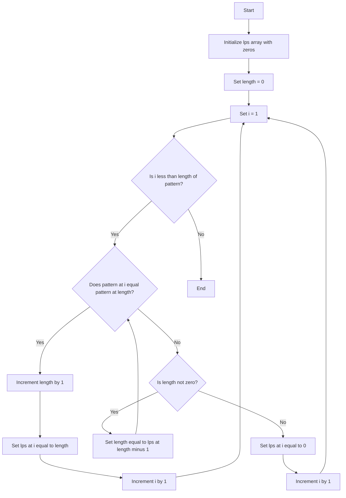

# Generating the LPS Array for KMP Algorithm

tags: #string_searching_algorithms #kmp

## Concept and Principles

The LPS (Longest Prefix Suffix) array is a crucial component of the [[Knuth–Morris–Pratt algorithm|KMP (Knuth-Morris-Pratt) string matching algorithm]]. It is used to optimize the search process by allowing the algorithm to bypass unnecessary character comparisons when a mismatch occurs. 

### Principles:
1. **Longest Prefix Suffix (LPS):** For a given pattern, the LPS value at each index \(i\) indicates the length of the longest proper prefix of the substring ending at \(i\) that is also a suffix of this substring.
2. **Proper Prefix:** A prefix of a string that is not equal to the string itself.
3. **Proper Suffix:** A suffix of a string that is not equal to the string itself.

## Steps to Generate the LPS Array

1. **Initialization:**
   - Create an array `lps` of the same length as the pattern, initialized to 0.
   - Initialize two variables: `length` (to store the length of the previous longest prefix suffix) and `i` (to iterate over the pattern).

2. **Iterate Over the Pattern:**
   - Start from the second character (index 1) of the pattern.
   - Compare the current character with the character at the `length` index.
     - If they match, increment `length` and set `lps[i]` to `length`, then move to the next character.
     - If they don't match and `length` is not zero, update `length` to `lps[length-1]`.
     - If they don't match and `length` is zero, set `lps[i]` to 0 and move to the next character.

3. **Completion:**
   - Continue this process until the entire pattern has been processed.



## Pseudocode

```python
def computeLPSArray(pattern):
    M = len(pattern)
    lps = [0] * M
    length = 0  # length of the previous longest prefix suffix
    i = 1
    
    while i < M:
        if pattern[i] == pattern[length]:
            length += 1
            lps[i] = length
            i += 1
        else:
            if length != 0:
                length = lps[length - 1]
            else:
                lps[i] = 0
                i += 1
    return lps
```

## Complexity Analysis

- **Time Complexity:** The time complexity of generating the LPS array is \(O(M)\), where \(M\) is the length of the pattern. Each character in the pattern is processed at most twice.
- **Space Complexity:** The space complexity is \(O(M)\) due to the storage requirement for the LPS array.

## Practical Applications

1. **String Matching:** The LPS array is essential for the KMP algorithm to perform efficient string matching, making it useful in text processing and search operations.
2. **Pattern Recognition:** Used in various applications where pattern recognition within a larger text is required, such as in DNA sequence analysis.
3. **Data Analysis:** Helps in analyzing repeated patterns within a dataset, providing insights into periodic behaviors or anomalies.

## Example

Consider the pattern "ABABAC":

1. Initialize `lps` as `[0, 0, 0, 0, 0, 0]`.
2. Start with `length = 0` and `i = 1`.
3. Iterate through the pattern:
   - At `i = 1`, pattern[1] ('B') != pattern[0] ('A'), so `lps[1] = 0`.
   - At `i = 2`, pattern[2] ('A') == pattern[0] ('A'), increment `length` to 1, set `lps[2] = 1`.
   - At `i = 3`, pattern[3] ('B') == pattern[1] ('B'), increment `length` to 2, set `lps[3] = 2`.
   - At `i = 4`, pattern[4] ('A') == pattern[2] ('A'), increment `length` to 3, set `lps[4] = 3`.
   - At `i = 5`, pattern[5] ('C') != pattern[3] ('B'), reset `length` to `lps[2] = 1`, then to `lps[0] = 0`, set `lps[5] = 0`.

Final `lps` array: `[0, 0, 1, 2, 3, 0]`.

The LPS array significantly enhances the efficiency of the KMP algorithm, enabling rapid and reliable string matching.