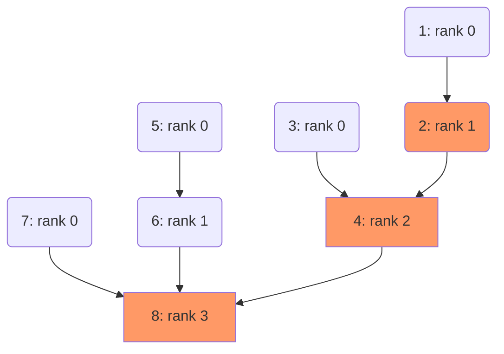

### Concept Explanation: Rank in Union-Find

The "rank" in the context of the Union-Find  is a strategy used to keep the structure balanced, ensuring efficient operations. Union-Find is primarily used to track a set of elements partitioned into one or more disjoint (non-overlapping) subsets. It supports two vital operations: [[Union-Find-Find Operation|`find`]], which identifies which subset a particular element is in, and [[Union-Find-Union Operation|`union`]], which merges two subsets into a single subset.

The rank is typically used as an approximation of the depth or height of trees representing the subsets in the Union-Find structure. Instead of literally keeping track of the depth, the rank keeps track of an upper bound on the depth, which helps to maintain the trees as flat as possible.

### Learning Significance

The implementation of rank is significant because it optimizes the Union-Find operations, particularly the [[Union-Find-Union Operation|`union`]] operation. By attaching the tree with a smaller rank (lower height) to the root of the tree with a larger rank, the rank approach helps keep the overall tree height shorter, leading to faster [[Union-Find-Find Operation|`find`]]operations. This is crucial in applications involving connectivity checks and component tracking in networks, such as in network analysis, image processing, or finding connected components in graphs.

### Example

Suppose you manage a set of elements: 1, 2, 3, 4, 5, initially in separate subsets. Each element starts with a rank of 0, indicating that each is its own root in a tree of height 1.

1. **Union(1, 2)**: Since both 1 and 2 have the same rank, either can become the root. If 1 becomes the root of 2, the rank of 1 will increase to 1 because the tree containing 1 and 2 now potentially has a greater height.
2. **Union(3, 4)**: Similar to the first union, if 3 becomes the root, its rank becomes 1.
3. **Union(1, 3)**: Now, since both 1 and 3 have the same rank (1), you choose one to be the root. If 1 becomes the root, its rank increases to 2 (indicating a new height that could be up to 3, but is actually 2).

### Example Analysis

In the above example:
- Initially, each element is its own tree with height 1 and rank 0.
- After each union operation involving elements with the same rank, the rank of the new root is incremented by 1, reflecting a potential increase in tree height.
- The rank helps in deciding the new root during a union operation, thereby keeping the tree as flat as possible.

### Similar Problems

1. **Union-Find Application**: You have 10 elements, initially disjoint. Perform unions in the sequence (1,2), (3,4), (5,6), (7,8), (1,3), (5,7), and (1,5). Track the rank of each root after each operation.
2. **Path Compression**: Using the same set of operations as in the previous problem, apply path compression in the `find` operation. Describe how this affects the ranks.
3. **Complex Networks**: Consider a graph with nodes representing people and edges representing friendships. Implement a Union-Find structure to determine how many unique groups of friends exist if the friendships are defined as pairs (1,2), (2,3), (4,5), (6,7), and (5,6).
