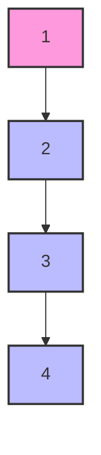
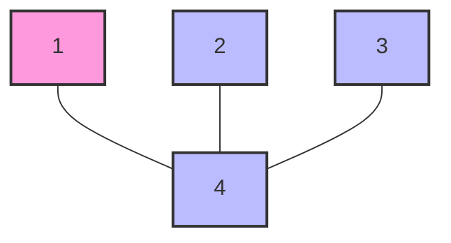

### Concept Explanation: Simplifying Rank in the Find Method

In the Union-Find data structure, the "[[Union-Find-Find Operation|find]]" method typically involves finding the root of the element, which determines the set to which the element belongs. The process can be optimized using "path compression," a technique that flattens the structure of the tree whenever "[[Union-Find-Find Operation|find]]" is called, effectively reducing the tree's height and thus simplifying the use of [[Union-Find-Rank|rank]].

### Learning Significance

Implementing path compression in the [[Union-Find-Find Operation|find]] method significantly improves the efficiency of the Union-Find operations. By making the trees flatter, it ensures that future operations require less time as they traverse fewer nodes. This technique is crucial in large datasets where operations such as connectivity checking or component tracking are frequent, as it dramatically decreases the time complexity of these operations.

### Example

Consider a Union-Find structure where we have the following set relationships, represented as trees:

- 1 is connected to 2, 2 is connected to 3, and 3 is connected to 4 (a linear chain).

When performing `find(1)`, without path compression, you would traverse all nodes up to 4. With path compression, once the root (4) is found, all nodes directly point to 4 for future operations.





```text
function find(x):
    if parent[x] != x:
        original_parent = parent[x]  // Store the original parent of x
        parent[x] = find(parent[x]) // Recursively find the root and compress the path
        rank[original_parent] -= 1  // Optionally adjust rank if necessary, typically not done here
    return parent[x]               // Return the root of x

```

### Example Analysis

When applying path compression during the `find(1)` operation:

- Initially, the path from 1 to 4 is 1 -> 2 -> 3 -> 4.
- After `find(1)` with path compression, the path becomes 1 -> 4, 2 -> 4, 3 -> 4 directly.

This restructuring directly modifies the parent links of 1, 2, and 3 to point directly to 4, reducing the path length and effectively reducing the impact of the [[Union-Find-Rank|rank]] since fewer steps are required to reach the root.

### Similar Problems

1. **Tree Height Reduction**: Consider a Union-Find structure initially formed by consecutive unions forming a single chain from 1 to 10. Apply the [[Union-Find-Find Operation|find]] operation to the first element using path compression and describe the resulting tree structure.
2. **Efficiency Analysis**: Using the same initial setup, compare the number of steps required to perform `find(1)` before and after path compression.
3. **Large Dataset Application**: Implement a Union-Find structure with 1000 elements in a linear sequence and apply path compression during [[Union-Find-Find Operation|find]] operations. Evaluate the impact on performance during multiple union and [[Union-Find-Find Operation|find]] operations.

These problems will help you understand how path compression simplifies [[Union-Find-Rank|rank]] and improves the performance of the Union-Find data structure.