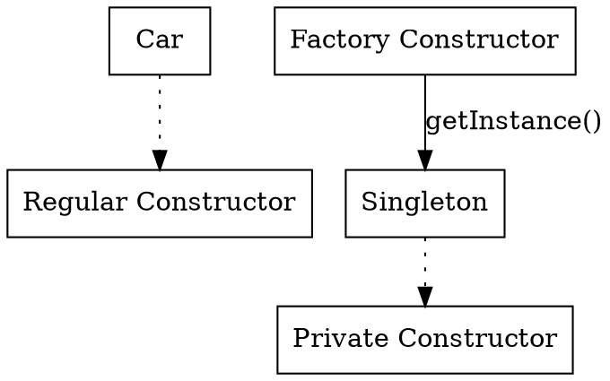

# Factory Constructor in Dart

## References

- <https://www.educative.io/answers/what-is-the-factory-keyword-in-dart>
- <https://dart.dev/language/constructors#redirecting-constructors>
- <https://dart-tutorial.com/object-oriented-programming/factory-constructor-in-dart/>
- <https://www.flutterclutter.dev/flutter/basics/2023-03-19-what-are-factory-constructors/>
- <https://dev.to/shanshaji/factory-keyword-in-dart-1g28>
- <https://stackoverflow.com/questions/53886304/understanding-factory-constructor-code-example-dart>

## What is a Factory Constructor

In Dart programming, a **factory constructor** is a special type of constructor that allows you to create objects in a different way than the regular constructors. It is often used to control the creation process and **return instances from cache or derived classes**.

Syntax:

```dart
class ClassName {
  factory ClassName() {
    // TODO: return ClassName instance
  }

  factory ClassName.namedConstructor() {
    // TODO: return ClassName instance
  }
}
```

## How it Works

Unlike regular constructors that always create a new instance, a factory constructor can decide to return an existing instance or create a new one. This can be useful in scenarios where object caching or optimization is needed.

```dart
class Car {
  String model;

  // Regular constructor
  Car(this.model);

  // Factory constructor
  factory Car.create(String model) {
    // Check if an instance with the same model exists
    // If yes, return that instance, otherwise create a new one
  }
}
```

## Benefits

1. **Instance Reuse**: Factory constructors can return cached instances, reducing memory usage by avoiding unnecessary object creation.

2. **Complex Initialization**: You can perform more complex operations during object creation, such as reading from a file or initializing based on certain conditions.

3. **Optimization**: By controlling the object creation process, you can optimize performance and resource utilization.

## Example: Creating a Singleton

A common use case of a factory constructor is creating a **singleton** instance, where only one instance of a class is allowed.

```dart
class Singleton {
  static Singleton _instance;

  // Private constructor
  Singleton._();

  factory Singleton.getInstance() {
    if (_instance == null) {
      _instance = Singleton._(); // Create a new instance if not exists
    }
    return _instance;
  }
}
```

## Conclusion

|         | Generative                 | Factory                                                 |
|---------|----------------------------|---------------------------------------------------------|
| Unnamed | `Cat(this.color);`         | `factory Cat(Color color) {return Cat(color);}`         |
| Named   | `Cat.colored(this.color);` | `factory Cat.colored(Color color) {return Cat(color);}` |

Factory constructors provide a powerful way to customize object creation in Dart. By using them, you can control the instantiation process, implement caching, and optimize the creation of instances.

---

**Class Diagram:**



**Note**: The above class diagram illustrates the relationships between the classes and their constructors using DOT language, representing the regular constructor and the factory constructor for the `Singleton` class.

Remember that factory constructors provide a mechanism to control object creation in Dart, allowing for better customization and optimization.
