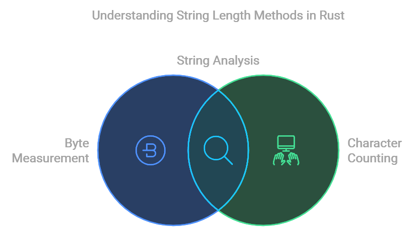

# Note on String Length Methods in Rust:

tags: #rust #string #concepts #bytes

- `s.len()`: Measures the **number of bytes** in the string. Useful for determining the size of a string in memory. Each character may take multiple bytes, especially for non-ASCII characters.
- `s.chars().count()`: Counts the **number of characters** (Unicode Scalar Values) in the string. Note that Unicode Scalar Values may still not match user-perceived characters in some cases, such as when characters are composed of multiple code points.



## When to Use:
- Use `s.len()` for operations involving byte length, such as indexing, storage, or serialization.
- Use `s.chars().count()` when you need the count of characters for display or user-facing purposes.

## Caveat:
- Some characters are composed of multiple code points (e.g., combining accents or emoji), so even `s.chars().count()` may not reflect the number of visible symbols. Use the `unicode_segmentation` crate for more accurate grapheme cluster counts. For example:

```rust
use unicode_segmentation::UnicodeSegmentation;

let s = "é";
let graphemes = s.graphemes(true).collect::<Vec<&str>>();
println!("Number of graphemes: {}", graphemes.len()); // Output: 1
```

