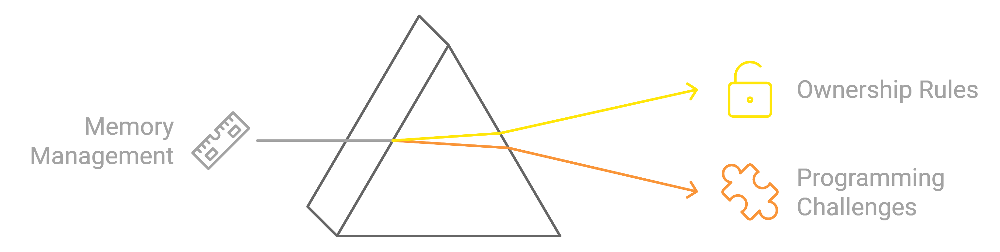
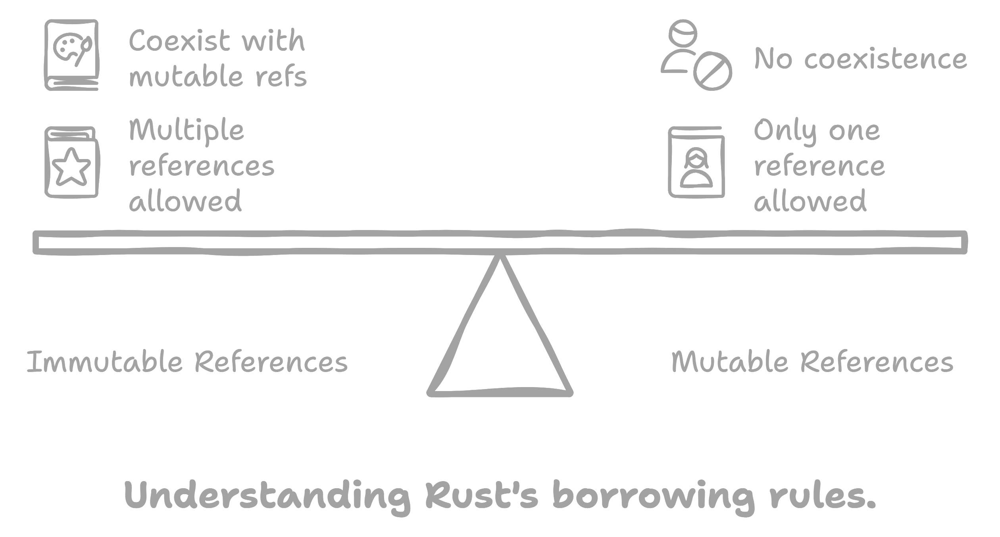
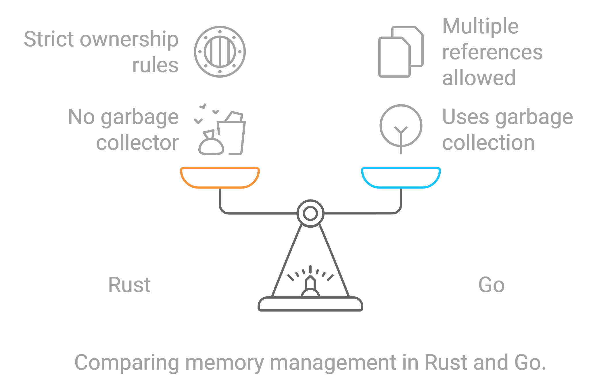

# Understanding Ownership and Borrowing in Rust: Deleting the Middle Node of a Linked List

tags: #rust #pointer #ownership #linked_list #leetcode/medium #two_pointers #golang 
## Introduction

This note summarizes our exploration of translating a Go solution for deleting the middle node of a linked list into Rust. It highlights the challenges encountered due to Rust's ownership and borrowing rules and presents solutions and key takeaways to aid in understanding Rust's memory management model.


---

## The Problem

**LeetCode Problem 2095:** Delete the Middle Node of a Linked List

Given the `head` of a singly linked list, delete the middle node, and return the modified list. If the list has only one node, return `None`.

---

## Original Go Solution

The Go implementation uses the fast and slow pointer technique (also known as the tortoise and hare algorithm) to find and delete the middle node efficiently.

```go
func deleteMiddle(head *ListNode) *ListNode {
    if head == nil || head.Next == nil {
        return nil
    }

    slow := &ListNode{Next: head}
    fast := head

    for fast != nil && fast.Next != nil {
        fast = fast.Next.Next
        slow = slow.Next
    }

    slow.Next = slow.Next.Next
    return head
}
```

---

## Initial Rust Translation Attempt

Attempting a direct translation of the Go code into Rust led to several compiler errors related to ownership and borrowing.

```rust
impl Solution {
    pub fn delete_middle(head: Option<Box<ListNode>>) -> Option<Box<ListNode>> {
        if head.is_none() || head.as_ref().unwrap().next.is_none() {
            return None;
        }

        let mut dummy = Box::new(ListNode::new(0));
        dummy.next = head;
        let mut slow: Option<Box<ListNode>> = Some(dummy);
        let mut fast: Option<Box<ListNode>> = head;

        while !fast.is_none() && !fast.as_ref().unwrap().next.is_none() {
            fast = fast.as_ref().unwrap().next.unwrap().next;
            slow = slow.as_ref().unwrap().next;
        }   
        slow = slow.as_ref().unwrap().next.unwrap().next;
        return head;
    }
}
```

**Compiler Errors:**

- **Use of moved value `head`**
- **Cannot move out of a shared reference**
- **Cannot borrow `head` as immutable because it is also borrowed as mutable**

---

## Understanding Rust's Ownership and Borrowing Rules

### Ownership Rules

1. **Each value has a single owner.**
2. **When the owner goes out of scope, the value is dropped.**
3. **Values can be moved but not copied unless they implement the `Copy` trait.**


### Borrowing Rules

- **Immutable References (`&T`):** Multiple immutable references are allowed.
- **Mutable References (`&mut T`):** Only one mutable reference is allowed at a time.
- **Cannot have mutable and immutable references coexisting.**



---

## Issues Encountered and Solutions

### Issue 1: Moving Ownership of `head`

**Problem:**

Assigning `head` to `dummy.next` moves ownership of `head`, making it unusable afterward.

```rust
dummy.next = head; // Moves ownership of `head` to `dummy.next`
```

**Solution:**

Avoid moving `head` by restructuring the code to work with references or by cloning `head` (though cloning is inefficient for large lists).

---

### Issue 2: Cannot Move Out of a Shared Reference

**Problem:**

Attempting to move a value out of a shared reference when accessing `next` nodes.

```rust
fast = fast.as_ref().unwrap().next.unwrap().next; // Moves value out of a shared reference
```

**Solution:**

Use `as_ref()` to borrow the inner value without moving it and work with references instead of ownership.

---

### Issue 3: Cannot Borrow as Mutable More Than Once

**Problem:**

Simultaneous mutable borrows of `head` via `slow` and `fast`.

```rust
let mut slow = &mut head; // First mutable borrow
let mut fast = &mut head.as_mut().unwrap().next; // Second mutable borrow
```

**Solution:**

- Avoid multiple mutable borrows by restructuring the algorithm.
- Use a single mutable reference when modifying the list.

---

## Adjusted Approach: Calculating Length First

Due to the challenges with the original approach, we adopt an alternative algorithm:

1. **Calculate the Length of the List:**

   Traverse the list to determine its length.

2. **Remove the Middle Node:**

   Traverse again to the node just before the middle node and adjust pointers to remove the middle node.


### Corrected Rust Code

```rust
impl Solution {
    pub fn delete_middle(mut head: Option<Box<ListNode>>) -> Option<Box<ListNode>> {
        // Step 1: Calculate the length of the list
        let mut len = 0;
        let mut curr = &head;
        while let Some(node) = curr {
            len += 1;
            curr = &node.next;
        }

        // If the list has only one node, return None
        if len == 1 {
            return None;
        }

        // Step 2: Traverse to the node just before the middle node
        let mid = len / 2;
        let mut curr = &mut head;

        for _ in 0..mid - 1 {
            curr = &mut curr.as_mut().unwrap().next;
        }

        // Step 3: Remove the middle node
        let next = curr.as_mut().unwrap().next.as_mut().unwrap().next.take();
        curr.as_mut().unwrap().next = next;

        head
    }
}
```

**Explanation:**

- **Single Mutable Reference:**
  - We use a single mutable reference `curr` to modify the list, complying with Rust's borrowing rules.
- **No Overlapping Borrows:**
  - By avoiding multiple mutable borrows, we prevent borrowing conflicts.

---

## Why the Original Approach Is Hard to Implement in Rust

### Rust's Ownership Model

- **Prevents Data Races:**
  - By enforcing strict ownership and borrowing rules.
- **Challenges with Linked Lists:**
  - Rust's model makes it difficult to have multiple pointers (like `slow` and `fast`) mutating a data structure simultaneously.

### Differences from Go

- **Go:**
  - Uses garbage collection.
  - Allows multiple references without ownership concerns.
- **Rust:**
  - No garbage collector.
  - Ownership and borrowing must be managed explicitly.


### Implementing with `Rc` and `RefCell`

- **Possible but Complex:**
  - Using `Rc` (Reference Counting) and `RefCell` (Interior Mutability) can allow multiple mutable references.
- **Trade-offs:**
  - Introduces runtime overhead.
  - Adds complexity to the code.
  - Potential for runtime panics if not carefully managed.

---

## Key Takeaways

### Understanding Ownership and Borrowing

- **Ownership:**
  - Each value in Rust has a single owner.
  - Values are moved, not copied, unless they implement the `Copy` trait.
- **Borrowing:**
  - References allow you to access data without taking ownership.
  - Mutable and immutable references have strict rules to prevent data races.

### Working with Linked Lists in Rust

- **Avoid Multiple Mutable References:**
  - Structure algorithms to use a single mutable reference when modifying data structures.
- **Consider Alternative Algorithms:**
  - If the straightforward approach conflicts with ownership rules, adapt the algorithm.
- **Use of `Option` and `Box`:**
  - Commonly used to represent nodes in a linked list (`Option<Box<T>>`).

### Differences Between Go and Rust

- **Memory Management:**
  - Go uses garbage collection; Rust uses ownership and borrowing.
- **Ease of Implementation:**
  - Algorithms involving multiple pointers are easier in Go due to less restrictive memory management.
- **Safety Guarantees:**
  - Rust provides compile-time safety guarantees at the cost of stricter rules.

---

## Conclusion

Translating algorithms from languages like Go to Rust requires a deep understanding of Rust's ownership and borrowing model. While certain approaches may be straightforward in garbage-collected languages, they might not align with Rust's memory safety guarantees.

By adapting algorithms and carefully managing references, we can write safe and efficient Rust code. The process highlights the importance of embracing Rust's paradigms and adjusting our strategies accordingly.

---

## Additional Resources

- **The Rust Programming Language Book:**
  - [Understanding Ownership](https://doc.rust-lang.org/book/ch04-01-what-is-ownership.html)
  - [References and Borrowing](https://doc.rust-lang.org/book/ch04-02-references-and-borrowing.html)
  - [Smart Pointers](https://doc.rust-lang.org/book/ch15-00-smart-pointers.html)
- **Rust Documentation:**
  - [Option Enum](https://doc.rust-lang.org/std/option/enum.Option.html)
  - [Box Type](https://doc.rust-lang.org/std/boxed/struct.Box.html)
- **Learning Resources:**
  - [Learn Rust With Entirely Too Many Linked Lists](https://rust-unofficial.github.io/too-many-lists/)
  - [Rust Ownership and Borrowing Explained](https://doc.rust-lang.org/book/ch04-00-understanding-ownership.html)

---

## Final Thoughts

Understanding Rust's ownership and borrowing rules is crucial for writing safe and efficient code. While it may introduce challenges when implementing certain algorithms, it ultimately leads to more robust and error-free programs.

Embrace Rust's paradigms, adapt your approaches, and continue exploring the language to harness its full potential.