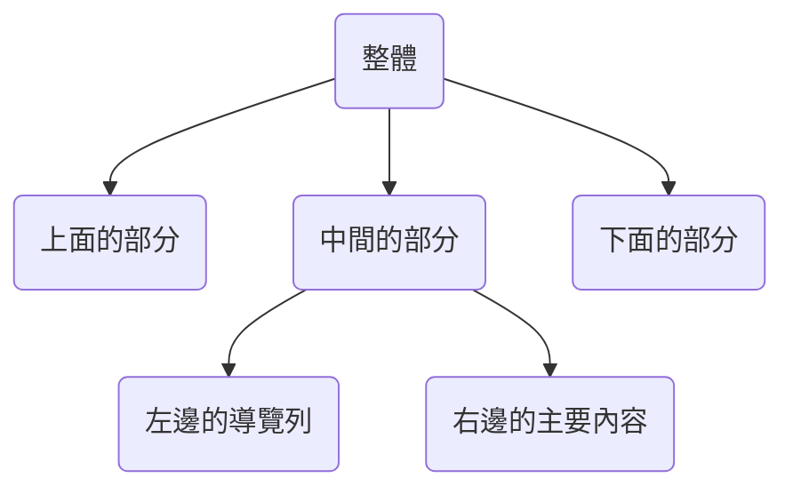

# 20220112


## Sample

總之先找個畫面來做做看


就從這個 vue ui 開始吧


## Overall

首先先把Hello world 和其他有的沒的都刪掉

App.vue

```vue
<template>
  <div></div>
</template>

<script lang="ts">
import { Options, Vue } from "vue-class-component";

@Options({})
export default class App extends Vue {}
</script>

<style>
#app {
  font-family: Avenir, Helvetica, Arial, sans-serif;
  -webkit-font-smoothing: antialiased;
  -moz-osx-font-smoothing: grayscale;
  text-align: center;
  color: #2c3e50;
  margin-top: 60px;
}
</style>

```


從縱向來看可以分成

* 上方的警告標語
* 左邊的導覽列+右邊的主要內容
* 下方的footer


從最上面的紅底白字警告標語開始

TopNav.vue

```vue
<template>
    <div class="bg-red-500">
        <p class="text-white">連線已中斷</p>
    </div>
</template>

<script lang="ts">
import { defineComponent } from 'vue'

export default defineComponent({
})
</script>

```


好我現在有一條警告標語了，只是沒有在最上方。找到App.vue裡面有給#app margin，把它刪掉就推上去了

```css
margin-top: 60px;
```


接著把中間跟下面都先切出來好了

順便把上面的TopNav 改名叫做 Top

```bash
D:.
│  App.vue
│  main.ts
│  shims-vue.d.ts
│
├─assets
│      logo.png
│      tailwind.css
│
└─components
        Bottom.vue
        Middle.vue
        Top.vue
```

大概像




簡單的切一切之後現在長成這樣


現在我希望把上方跟下方固定住，中間填滿剩餘的空間

試著給footer 加入 `fixed` 把它固定在底部

```vue
<template>
    <div class="bg-black text-white fixed bottom-0">footer</div>
</template>
```

然後變成這樣


看來還需要給他指定寬度 `w-screen`


接著就可以來處理中間的部分了


先試著使用`h-screen`


很接近了，但右邊多了個scroll bar，應該是middle的部分比想像中的還要長，試著把top的部分也fix起來


完美


中間再切一切


讚讚


## Middle

### Navigator

先從左邊的導航列開始


最上面是一個Combo box，接著是按鈕列，最下方再一個按鈕


#### Combo box

這邊我用一個button和一個list呈現

button 套上 rounded-full 後看起來和原版很接近了(就是短了點)

list 加入 v-show 然後 綁一個用button切換的變數，就可以做到很像展開的樣子。


還有一個小差別是原版的combo box 是在click的時候變色，我這邊用hover是在focus的時候變色

```css
        bg-green-100
        hover:bg-green-200
```


或許我可以考慮用click來完成他，不過先算了有點麻煩


#### Nav List

下面的list就用v-for來呈現，這樣才有練習vue的感覺

在data裡面新增array

```typescript
nav_list: ['控制台', '插件', '依賴', '設定', '任務']
```

```html
  <div id="nav-list" class="mt-6">
      <ul>
          <template v-for="link in nav_list" :key="link">
              <li>{{link}}</li>
          </template>
      </ul>
  </div>
```


字有點擠，修一下排版，順便加上focus變色

```html
    <div id="nav-list" class="mt-6">
      <ul>
        <template v-for="link in nav_list" :key="link">
          <li>
              <div class="h-11 hover:bg-green-50 grid content-center">
                  <b>{{link}}</b>
              </div>
          </li>
        </template>
      </ul>
    </div>
```

 

比較一下原版，還差

* 游標變成手的形狀，這個應該是有連結就會自動變的吧
* 項目前方的icon，這個我不打算做
* 右邊跑出來的小對話框 => 感覺應該也可以用v-show完成，不過在迴圈裡面比較複雜些


data

```js
      nav_obj_list: [
        {
          name: "控制台",
          showTag: false,
        },
        {
          name: "插件",
          showTag: false,
        },
        {
          name: "依賴",
          showTag: false,
        },
        {
          name: "設定",
          showTag: false,
        },
        {
          name: "任務",
          showTag: false,
        },
      ],
```

template

```html
    <div id="nav-list" class="mt-6">
      <ul>
        <template v-for="link in nav_obj_list" :key="link.name">
          <li>
            <div class="h-11 hover:bg-green-50 grid content-center" @formchange="link.showTag = !link.showTag" >
              <b>{{ link.name }}</b>
              <b v-if="link.showTag">tag</b>
            </div>
          </li>
        </template>
      </ul>
    </div>
  </div>
```


結果失敗沒有作用，果然沒有我想的那麼簡單


然後又發現一個新的問題，就是先前的combobox

 

把下面的東西往下擠顯然是不合理的...

把item新增 position 和 z-index 就OK啦

```css
class = "absolute z-10"
```


#### footer button

接著來做最下面的按鈕，按下後會展開一個選單


完成


結果卡最久的地方在展開後變色的行為，一直糾結在如何bind兩個以上的 classes 進去，一直沒想到只要把他們都寫在一個字串裡就好...

```typescript
@Options({
    data(){
        return{
            menu_class: 'bg-white hover:bg-green-50 text-black'
        }
    }
})
```

再搭一個method去變化他

```typescript
methods: {
    OnMenuClick: function ():void {
      this.more = !this.more
      if(this.more){
        this.menu_class = 'bg-gray-700 hover:bg-gray-700 text-white'
      }
      else{
        this.menu_class = 'bg-white hover:bg-green-50 text-black'
      }
    },
  },
```


中間也有試過把這些classes寫到一個class裡面，然後bind它

```css
.menu-open{
    @apply bg-gray-700 hover:bg-gray-700 text-white;
}
```

不過不知道為甚麼完全沒有被渲染出來。


也有試過bind一個回傳string的function，不過完全沒有作用。


#### Router

補一下Router連結

把nav_list改成

```typescript
      nav_list: [
        {
          name:"控制台",
          link:"/console"
          },
       {
         name:"插件",
         link:"/plugins"
         },
       {
         name:"依賴",
         link:"/dependencies"
         },
       {
         name:"設定",
         link:"/configuration"
         },
       {
         name:"任務",
         link:"/tasks"
         },
       ],
```

加入連結

```html
        <template v-for="link in nav_list" :key="link.name">
          <li>
            <div class="h-11 hover:bg-green-50 grid content-center">
              <router-link :to="link.link">{{ link.name }}</router-link>
            </div>
          </li>
        </template>
```


配合router/index.ts

```typescript
import { createRouter, createWebHistory, RouteRecordRaw } from 'vue-router'

const routes: Array<RouteRecordRaw> = [
  {
    path: '/',
    name: 'Console',
    component: () => import('./../components/Content/Console.vue')
  },
  {
    path: '/console',
    name: 'Console',
    component: () => import('./../components/Content/Console.vue')
  },
  {
    path: '/configuration',
    name: 'Configuration',
    component: () => import('./../components/Content/Configuration.vue')
  },
  {
    path: '/dependencies',
    name: 'Dependencies',
    component: () => import('./../components/Content/Dependencies.vue')
  },
  {
    path: '/plugins',
    name: 'Plugins',
    component: () => import('./../components/Content/Plugins.vue')
  },
  {
    path: '/tasks',
    name: 'Tasks',
    component: () => import('./../components/Content/Tasks.vue')
  }
]

const router = createRouter({
  history: createWebHistory(process.env.BASE_URL),
  routes
})

export default router

```


 讓Content呈現出router-view

```vue
<template>
  <div class="bg-green-100 ml-1 w-full">
    <content-nav />
    <router-view></router-view>
  </div>
</template>

<script lang="ts">
import { Options, Vue } from "vue-class-component";
import ContentNav from "./Content/ContentNav.vue";

@Options({
  components: {
    ContentNav,
  },
})
export default class App extends Vue {}
</script>

```


這次練習先到這裡為止，感覺比較困難的地方都不是vue反而在排版(css)上面。