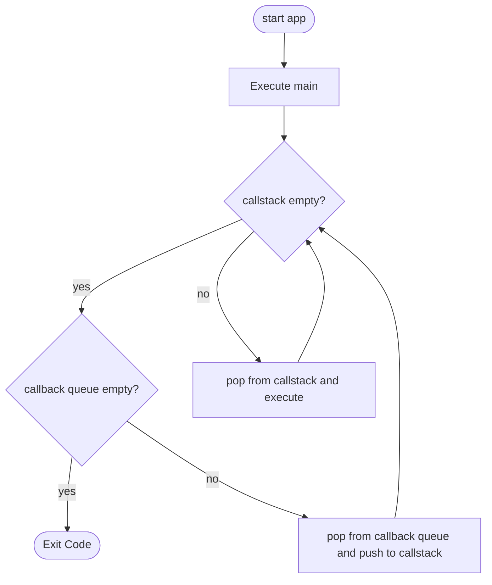

# Javascript Async

tags: #javascript #async #typescript

## References:

[mozilla](https://developer.mozilla.org/zh-TW/docs/Learn/JavaScript/Asynchronous/Introducing)

[How JavaScript works: Event loop and the rise of Async programming + 5 ways to better coding with async/await](https://blog.sessionstack.com/how-javascript-works-event-loop-and-the-rise-of-async-programming-5-ways-to-better-coding-with-2f077c4438b5)

[JavaScript 中的同步與非同步 – Event Loop 原理](https://jimmyswebnote.com/javascript-sync-async/)

[【筆記】到底 Event Loop 關我啥事？](https://medium.com/infinitegamer/why-event-loop-exist-e8ac9d287044)

## Abstract

雖然是分類在js筆記中，不過我還是會使用ts來寫範例程式。

`Promise` `async` `await` 這些沒啥特色的東西我就不記錄了，這篇筆記重點紀錄底層的一些原理。

同理，`Process` `Thread` 這些基礎也不會再寫一遍，可以參考無分類的Async筆記。

## 阻塞問題

> 瀏覽器是由許多不同的 process 所組成，不同的 process 負責不同的工作內容，舉例來說：
>
> * Browser process: 負責瀏覽器中的網址列、上一頁、下一頁按鈕、書籤、網路連線、檔案存取等等功能。
> * Plugin process: 負責瀏覽器中的第三方套件，像是 Adobe reader、flash 等等。
> * GPU process: 負責幫助渲染 (render) 網頁中的影片和圖片 。
> * Renderer process: 負責整個網頁的渲染 (render) ，執行 HTML、CSS 以及 JavaScript。
> 每個 process 各自負責不同的工作，每個 process 又至少有一個 thread (執行緒) 來負責執行相關工作。
>
> 其中 HTML、CSS 的解析以及 JavaScript 的執行是由 renderer process 中的 main thread 所負責的，所以當你的 JavaScript 執行一個很耗時的同步工作時，就會導致網頁沒> 辦法渲染 (render) 。

節錄自 [jimmy's note](https://jimmyswebnote.com/javascript-sync-async/)

## event loop

從上文可以看到，JS的程式碼都執行在同一個thread。基本上它要實現非同步就必須用和dart相似的event loop機制。

不過 js 的 event loop 和 dart 還是有許多不一樣的地方。這些地方也就是這篇筆記主要想記錄的重點了。

跟dart筆記一樣，先來畫個流程圖。畫完發現，流程看起來相似度極高。(但實際上還是有不少差別)



註: `call` 在 mermaid 裡面似乎是關鍵字不能用，所以把 `call stack` 寫作 `callstack` 。 `callback queue` 在某些文章中寫作 `task queue` 。


### call stack

js 執行function的方式

例如

```typescript
function func1():void{
    func2();
}

function func2():void{
    console.log("Hello");
}

function func3():void{
    console.log("world");
}

func1();
func3();
```

stack的狀況如下:

1. `func1()`
2. `func1()` `func2()`
3. `func1()` `func2()` `console.log("Hello")`
4. `func1()` `func2()`
5. `func1()`
6. 
7. `func3()`
8. `func3()` `console.log("world")`
9. `func3()`
10. 


### callback queue

非同步的方法在執行完成後會進入這個queue，找機會放入call stack

這篇文章的範例不錯，借用一下

```javascript
console.log('Hi');
setTimeout(function cb1() { 
    console.log('cb1');
}, 5000);
console.log('Bye');
```


## 應用

差不多都了解完了，是時候來小試身手了。

把dart筆記裡面的範例程式碼copy過來翻譯成ts，試試看能不能分析出個所以然。


```typescript
export function eventQueueSample() {
  var fAsync1 = async (): Promise<void> => {
    console.log("<1> start");
    const end: Date = new Date();
    end.setSeconds(end.getSeconds() + 2);
    while (new Date() < end);
    console.log("<1> end");
  };
  fAsync1();
  asyncFunction2();
}

async function asyncFunction2(): Promise<void> {
  console.log("<2> start");
  var fAsync3 = async (): Promise<void> => {
    console.log("<3> start");
    const end: Date = new Date();
    end.setSeconds(end.getSeconds() + 2);
    while (new Date() < end);
    console.log("<3> end");
  };
  await fAsync3();
  console.log("<2> end");
}
```

結果(與dart一樣執行了4秒)

```text
<1> start
<1> end
<2> start
<3> start
<3> end
<2> end
```


流程推理，用table表示好了，由上往下代表順序:

| Description            | Call stack                                        | Callback queue |
| ---------------------- | ------------------------------------------------- | -------------- |
| 進入`eventQueueSample` | `eventQueueSample`                                |                |
|                        | `eventQueueSample` `fAsync1()`                    |                |
| `fAsync()`執行結束     | `eventQueueSample`                                |                |
| <2> start              | `eventQueueSample` `asyncFunction2()`             |                |
| <3> start<br/><3> end  | `eventQueueSample` `asyncFunction2()` `fAsync()3` |                |
| <2> end                | `eventQueueSample` `asyncFunction2()`             |                |
|                        | `eventQueueSample`                                |                |

好吧，這個例子非常不適合js，這個範例對他來說和同步方法沒有兩樣，`await`有跟沒有都不影響結果。

