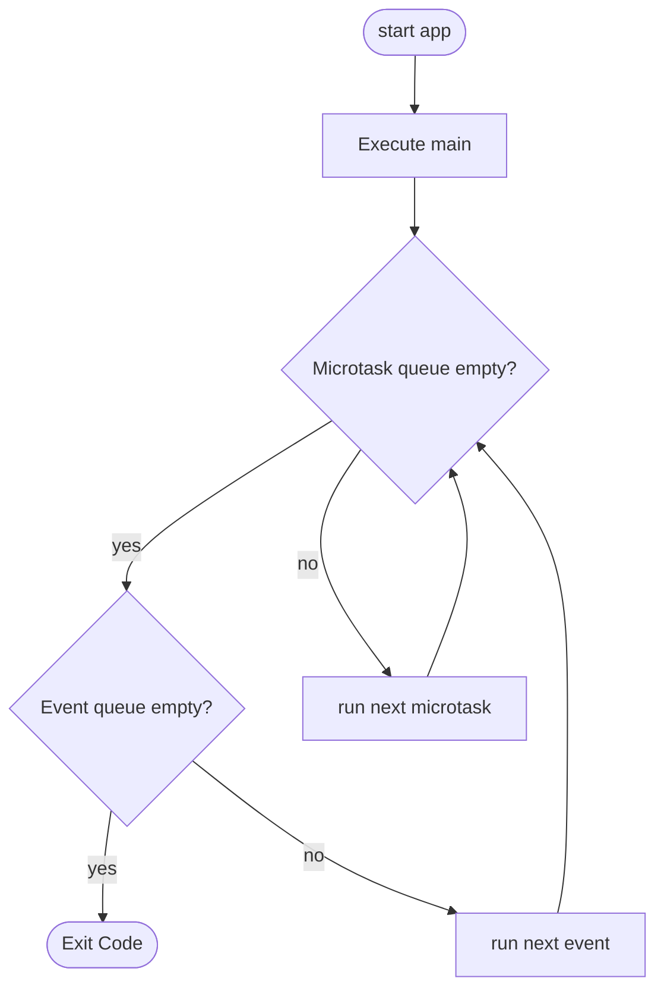

# Async

#golang #c_sharp #dart #typescript #async

## Abstract

每次學習新的語言時非同步的寫法總是會成為重點學習的項目之一。

至今也寫了很多關於非同步的筆記。

不過學得多了，反而會對於彼此間的差異感到模糊，這次整理這篇筆記正是為了釐清至今學過的語言在撰寫非同步程式時有哪些異同。

詳細的內容還是會放在各個語言的筆記裡面。這篇只注重比較。

本篇筆記的程式碼範例放在`./Samples/async_samples`資料夾中。

## 觀念釐清

開始之前來複習一些比較重要的觀念

### Program, Process, Thread and Coroutine

[參考資料](https://totoroliu.medium.com/program-process-thread-%E5%B7%AE%E7%95%B0-4a360c7345e5)

#### Program

尚未被執行的程式碼

#### Process

Program被執行且被讀取至記憶體後產生Process。

```powershell
PS C:\Users\rockefel> Get-Process

Handles  NPM(K)    PM(K)      WS(K)     CPU(s)     Id  SI ProcessName
-------  ------    -----      -----     ------     --  -- -----------
    420      25    17132       9136       0.73  13220   1 ApplicationFrameHost
    130       9     1636       2064       0.00   3392   0 armsvc
    188       9     7628       8832     122.67   4608   1 bash
     96       7     1460       3392       0.00  10192   1 bash
    184       9     7488       4028      48.36  12792   1 bash
     96       7     1464       3392       0.02  13700   1 bash
    574      31    37500       2164       0.61  33764   1 Calculator
    923      20    78308      10744      56.89    308   1 chrome
    249      16   112456      76236     108.94   1184   1 chrome
    285      17    74768      27140      21.42   1268   1 chrome
    294      15    22660      36196       8.70   1884   1 chrome
    260      16    19692      14904       2.14   2128   1 chrome
    474      24   114080      12812     168.27   2412   1 chrome
    363      20    60040     108920      18.17   2480   1 chrome
```

一個Program可以有多個Processes， 就像上圖chrome多開就會有多個。

Processes 彼此獨立。

Process 內涵一個或多個thread，為執行的基本單位。

dart的isolate就屬於這個層級。

#### Thread

執行的基本單位。

同Process底下的threads共享資源。

屬於 Preemptive multitasking 由系統根據Thread的優先權來決定CPU的分配時間

#### Coroutine

新觀念，細節比較多，細節可以參考這篇[系列文章](https://ithelp.ithome.com.tw/users/20129264/ironman/3966)(Kotlin)

Cooperation + Routine

屬於 Cooperative multitasking ，每個Task都會定時放棄執行全

可以看做輕量型Thread，建立、切換和取消的成本都很低

### Concurrent and Parallel

[wiki Concurrent](https://en.wikipedia.org/wiki/Concurrent_computing)

[wiki Parallel](https://en.wikipedia.org/wiki/Parallel_computing)

> - Concurrent：Concurrent 主要是一個 CPU 會去做多件事，但是同一個時間點之內只會做一件事，舉例來說一個人可能會去做 Job1、Job2、Job3這三件事，但是在一個時間點內只會做一個 Job，像是早上做 Job1、下午做 Job2、晚上做 Job3不斷的切換。Concurrent 的目標是希望能做更多的事。
> - Parallel： Parallel 主要是會有多個 CPU 在同一個時間點內會去做多件事，例如會有三個人同時分別在做 Job1、Job2、Job3 的事情。因此 Parallel 的目標是希望能把事情更快速的做完。

[reference](https://ithelp.ithome.com.tw/articles/10201828)

### Threads and Event Loops

至今學過的語言非同步的做法主要可以分成這兩類

| Threads  | Event Loops     |
| -------- | --------------- |
| C# Go(?) | dart javascript |

多執行緒比較沒啥問題。單執行緒+事件迴圈比較不直覺，礙於篇幅，以下提供兩篇文章參考，或者在我的dart筆記裡面也有較詳細的說明。

reference: [js](https://jimmyswebnote.com/javascript-sync-async/) [dart](https://ithelp.ithome.com.tw/articles/10240626)

## 應用

來個情境模擬好了。希望能展現出各語言的特色。

今天有一個系統，可以分為三個專案，分別為db api ui ，每次有一個新的需求，都需要三個專案配合進行改動才能完成

### 同步的情況

今天來了個新需求，需要db工程師花費3秒 api 1秒 ui 2秒 來完成。在同步程式中大概像是下面這樣。

```mermaid
gantt
    title 同步的情況
    dateFormat mm:ss
    axisFormat %M:%S
    section Sync
    DB   :start, 3s
    API  :1s
    UI   :2s
```

總共就必須花費 3+1+2秒來完成這個需求。

#### golang

主體

```go
func sync() {
 job := job{
  db:  3,
  api: 1,
  ui:  2,
 }
 var dbEngineer dbEngineer
 var apiEngineer apiEngineer
 var uiEngineer uiEngineer

 dbEngineer.do(job)
 apiEngineer.do(job)
 uiEngineer.do(job)
}
```

其他部分(一些比較trivial的部分就用 //... 帶過，後面也是)

```go
type dbEngineer struct{}

func (dbEngineer) do(job job) {
 fmt.Println("db task start")
 time.Sleep(time.Second * time.Duration(job.db))
 fmt.Println("db task complete")
}
//...

type job struct {
 db  int64
 api int64
 ui  int64
}
```

執行結果

```
db task start
db task complete
api task start
api task complete
ui task start
ui task complete
```

#### dart

```dart
import 'dart:io';

void main() {
  Job job = Job(3, 1, 2);
  DBEngineer dbEngineer = DBEngineer();
  APIEngineer apiEngineer = APIEngineer();
  UIEngineer uiEngineer = UIEngineer();
  dbEngineer.doTask(job);
  apiEngineer.doTask(job);
  uiEngineer.doTask(job);
}

class Job {
  int db = 0;
  int api = 0;
  int ui = 0;
  Job(int db, int api, int ui) {
    this.db = db;
    this.api = api;
    this.ui = ui;
  }
}

abstract class IEngineer {
  void doTask(Job job);
}

class DBEngineer extends IEngineer {
  void doTask(Job job) {
    print("db task start");
    sleep(Duration(seconds: job.db));
    print("db task complete");
  }
}
//...
```

執行結果

```
db task start
db task complete
api task start
api task complete
ui task start
ui task complete
```

#### C\#

```C#
using System;
using System.Threading.Tasks;

namespace Async{
    internal interface IEngineer{
        void Do(Job job);
    }

    internal class DBEngineer : IEngineer{
        public void Do(Job job){
            Console.WriteLine("db task start");
            Task.Delay(job.db * 1000).Wait();
            Console.WriteLine("db task complete");
        }
    }

    //...

    partial class Program{
        static void Sync(){
            Job job = new Job(3,1,2);
            DBEngineer dbEngineer = new DBEngineer();
            APIEngineer apiEngineer = new APIEngineer();
            UIEngineer uiEngineer = new UIEngineer();
            dbEngineer.Do(job);
            apiEngineer.Do(job);
            uiEngineer.Do(job);
        }
    }
}


```

```C#
namespace Async
{
    internal class Job
    {
        internal int db;
        internal int api;
        internal int ui;
        internal Job(int db, int api, int ui)
        {
            this.db = db;
            this.api = api;
            this.ui = ui;
        }
    }
}
```

執行結果

```
db task start
db task complete
api task start
api task complete
ui task start
ui task complete
```

#### TS

(我找不到同步的等待方法，所以只能寫成async來模擬)

```typescript
function sync(): void {
    var job = new Job(3,1,2);
    var dbEngineer = new DBEngineer();
    var apiEngineer = new APIEngineer();
    var uiEngineer = new UIEngineer();
    dbEngineer.do(job).then(
        ()=>{apiEngineer.do(job).then(
            ()=>{uiEngineer.do(job)}
        );}
    );
}

class Job {
    db:number;
    api:number;
    ui:number;
    constructor(db:number, api:number, ui:number){
        this.db = db;
        this.api = api;
        this.ui = ui;
    }
}

interface IEngineer {
    do(job: Job): void;
}

class DBEngineer implements IEngineer {
    async do(job:Job){
        console.log("db task start")
        await new Promise(f => setTimeout(f, 1000 * job.db));
        console.log("db task complete")
    }
}
//...
```

執行結果

```
[LOG]: "db task start" 
[LOG]: "db task complete" 
[LOG]: "api task start" 
[LOG]: "api task complete" 
[LOG]: "ui task start" 
[LOG]: "ui task complete" 
```

### 如果三個專案可以同時進行

這次工程師之間彼此先討論好該做些甚麼，不需要等別人的工作完成就可以開始自己的作業了

```mermaid
gantt
    title 非同步的情況
    dateFormat mm:ss
    axisFormat %M:%S
    section Async
    DB   :start , 3s
    API  :start , 1s
    UI   :start , 2s
```

同樣的需求，這次只需要三秒就能完成啦。

#### golang

```go
package main

import "sync"

func asyncFunc1() {
 job := job{
  db:  3,
  api: 1,
  ui:  2,
 }
 var dbEngineer dbEngineer
 var apiEngineer apiEngineer
 var uiEngineer uiEngineer

 wg := sync.WaitGroup{}
 wg.Add(3)

 go func() {
  dbEngineer.do(job)
  wg.Done()
 }()
 go func() {
  apiEngineer.do(job)
  wg.Done()
 }()
 go func() {
  uiEngineer.do(job)
  wg.Done()
 }()

 wg.Wait()
}

```

執行結果

```
ui task start
db task start
api task start
api task complete
ui task complete
db task complete
```

#### dart

主要內容

```dart
void async1(){
  Job job = Job(3, 1, 2);
  DBEngineer dbEngineer = DBEngineer();
  APIEngineer apiEngineer = APIEngineer();
  UIEngineer uiEngineer = UIEngineer();
  Future<void> task1 = dbEngineer.doTaskAsync(job);
  Future<void> task2 = apiEngineer.doTaskAsync(job);
  Future<void> task3 = uiEngineer.doTaskAsync(job);

  Future.wait({task1, task2, task3});
}
```

最後一行的等待可以不寫，不影響執行，dart和js一樣，不會有主執行緒關閉其他執行緒會一起消失的問題。不過這邊就嚴謹一點還是加上去了。

非同步方法

```dart
class DBEngineer extends IEngineer {
  void doTask(Job job) {
    print("db task start");
    sleep(Duration(seconds: job.db));
    print("db task complete");
  }

  Future<void> doTaskAsync(Job job) async {
    print("db task start");
    await Future.delayed(Duration(seconds: job.db));
    print("db task complete");
  }
}

//...
```

注意這邊不能再使用`sleep`，因為`sleep`期間其他非同步行為也無法執行，所以要改用非同步的`Future.delay`，並且等它。

```dart
/// Sleep for the duration specified in [duration].
///
/// Use this with care, as no asynchronous operations can be processed
/// in a isolate while it is blocked in a [sleep] call.
void sleep(Duration duration)
```

當然也可以不要用`async`來實作它，直接return Future物件也是OK的。

```dart
  Future<void> doTaskAsync(Job job) {
    return Future<void>(() async {
      print("db task start");
      await Future.delayed(Duration(seconds: job.db));
      print("db task complete");
    });
  }
```

執行結果

```
db task start
api task start
ui task start
api task complete
ui task complete
db task complete
```

#### C#

主要內容

```C#
using System.Threading.Tasks;

namespace Async
{
    partial class Program
    {
        static async void Async1()
        {
            var job = new Job(3, 1, 2);
            var dbEngineer = new DBEngineer();
            var apiEngineer = new APIEngineer();
            var uiEngineer = new UIEngineer();
            Task task1 = dbEngineer.DoAsync(job);
            Task task2 = apiEngineer.DoAsync(job);
            Task task3 = uiEngineer.DoAsync(job);
            await Task.WhenAll(task1, task2, task3);
        }
    }
}
```

非同步修改

```C#
 internal class DBEngineer : IEngineer
    {
        public void Do(Job job)
        {
            Console.WriteLine("db task start");
            Task.Delay(job.db * 1000).Wait();
            Console.WriteLine("db task complete");
        }

        async public Task DoAsync(Job job){
            Console.WriteLine("db task start");
            await Task.Delay(job.db * 1000);
            Console.WriteLine("db task complete");
        }
    }
```

執行結果

```
db task start
api task start
ui task start
api task complete
ui task complete
db task complete
```

#### TS

基本上和dart類似

```typescript
function async1():Promise<void>{
    var job = new Job(3,1,2);
    var dbEngineer = new DBEngineer();
    var apiEngineer = new APIEngineer();
    var uiEngineer = new UIEngineer();

    var task1:Promise<void> = dbEngineer.do(job)
    var task2:Promise<void> = apiEngineer.do(job)
    var task3:Promise<void> = uiEngineer.do(job)

    Promise.all([task1, task2, task3])
    return null;
}
```

和dart一樣即便不等待也可以順利印出內容。

執行結果

```
db task start
api task start
ui task start
api task complete
ui task complete
db task complete
```

### 其他變化: api專案必須在db專案完成後才開始動工

```mermaid
gantt
    title 非同步的情況
    dateFormat mm:ss
    axisFormat %M:%S
    section Async
    DB   :start, 3s
    API  :1s
    UI   :start, 2s
```

上面那些搞懂後，其他變化也就手到擒來。

#### golang

```go
func asyncFunc2() {
 job := job{
  db:  3,
  api: 1,
  ui:  2,
 }
 var dbEngineer dbEngineer
 var apiEngineer apiEngineer
 var uiEngineer uiEngineer

 wgAll := sync.WaitGroup{}
 wgAll.Add(3)

 dbDone := make(chan bool)

 go func() {
  dbEngineer.do(job)
  wgAll.Done()
  dbDone <- true
 }()

 go func() {
  if <-dbDone {
   apiEngineer.do(job)
   wgAll.Done()
  }
 }()

 go func() {
  uiEngineer.do(job)
  wgAll.Done()
 }()

 wgAll.Wait()
}

```

執行結果

```
ui task start
db task start
ui task complete
db task complete
api task start
api task complete
```

#### dart

```dart
void async2(){
  Job job = Job(3, 1, 2);
  DBEngineer dbEngineer = DBEngineer();
  APIEngineer apiEngineer = APIEngineer();
  UIEngineer uiEngineer = UIEngineer();
  Future<void> task1 = dbEngineer.doTaskAsync(job).then((value) => apiEngineer.doTaskAsync(job));
  Future<void> task2 = uiEngineer.doTaskAsync(job);

  Future.wait({task1, task2});
}
```

執行結果

```
db task start
ui task start
ui task complete
db task complete
api task start
api task complete
```

#### C#

```C#
using System.Threading.Tasks;

namespace Async
{
    partial class Program
    {
        static async void Async2()
        {
            var job = new Job(3, 1, 2);
            var dbEngineer = new DBEngineer();
            var apiEngineer = new APIEngineer();
            var uiEngineer = new UIEngineer();
            Task task1 = dbEngineer.DoAsync(job);
            Task task3 = uiEngineer.DoAsync(job);

            await task1;
            Task task2 = apiEngineer.DoAsync(job);
            await Task.WhenAll(task2, task3);
        }
    }
}
```

執行結果

```C#
db task start
ui task start
ui task complete
db task complete
api task start
api task complete

```

#### TS

```typescript
function async2():Promise<[void,void]>{
    var job = new Job(3,1,2);
    var dbEngineer = new DBEngineer();
    var apiEngineer = new APIEngineer();
    var uiEngineer = new UIEngineer();

    var task1:Promise<void> = dbEngineer.do(job).then(() =>apiEngineer.do(job))
    var task2:Promise<void> = uiEngineer.do(job)

    return Promise.all([task1, task2])
}
```

執行結果

```
[LOG]: "db task start" 
[LOG]: "ui task start" 
[LOG]: "ui task complete" 
[LOG]: "db task complete" 
[LOG]: "api task start" 
[LOG]: "api task complete"
```

## 特色

這邊再稍微深入一點比較各語言的特色及差異，還有一部分我自己使用上的感想。詳細的內容還是會放在各語言的筆記裡面。

### golang

寫非同步的門檻超低。`waitGroup` `errorGroup` lock 等都很好懂。唯一比較需要下功夫去了解的大概就只有`channel`的觀念了。

同步和非同步方法沒有明確的差異，只要加上關鍵字`go`任何方法都可以立刻變為非同步呼叫。

非同步屬於coroutine層級。相當輕便。

仿照下面的dart範例來個golang版本

```go
package main

import (
 "fmt"
 "sync"
 "time"
)

func eventQueueSample() {
 wg := sync.WaitGroup{}
 wg.Add(2)
 go func() {
  fmt.Println("<1> start")
  end := time.Now().Add(2 * time.Second)
  for time.Now().Before(end) {
  }
  fmt.Println("<1> end")
  wg.Done()
 }()
 asyncFunction(&wg)
 wg.Wait()
}

func asyncFunction(outerWg *sync.WaitGroup) {
 fmt.Println("<2> start")
 wg := sync.WaitGroup{}
 wg.Add(1)
 go func() {
  fmt.Println("<3> start")
  end := time.Now().Add(2 * time.Second)
  for time.Now().Before(end) {
  }
  fmt.Println("<3> end")
  wg.Done()
 }()
 wg.Wait()
 fmt.Println("<2> end")
 outerWg.Done()
}

```

執行結果

```text
<2> start
<3> start
<1> start
<3> end
<2> end
<1> end
```

```text
<2> start
<1> start
<3> start
<1> end
<3> end
<2> end
```

```text
<2> start
<3> start
<1> start
<1> end
<3> end
<2> end
```

同時執行的關係，每次結果都會不一樣

### dart

有Process層級的isolate和Thread層級的Event Loop可以用，算是相當有彈性。

不論是isolate還是 event loop都有點複雜，不是很好上手。

event loop 執行流程務必記熟



有些東西執行起來沒有那麼直觀

```dart
void eventQueueSample() {
  Future(() {
    print("<1> start");
    DateTime end = DateTime.now().add(Duration(seconds: 2));
    while (DateTime.now().isBefore(end));
    print("<1> end");
  });
  asyncFunction();
}

Future<void> asyncFunction() async {
  print("<2> start");
  await Future(() {
    print("<3> start");
    DateTime end = DateTime.now().add(Duration(seconds: 2));
    while (DateTime.now().isBefore(end));
    print("<3> end");
  });
  print("<2> end");
}
```

執行結果

```text
<2> start
<1> start
<1> end
<3> start
<3> end
<2> end
```

原理請參照流程，或Dart筆記。

### C#

`Task`很好用，雖然沒有Golang好上手，但也算相當簡單了。

來模仿一下上面dart的範例看看

```C#
using System.Threading.Tasks;
using System;

namespace Async
{
    partial class Program
    {
        static void EventQueueSample()
        {
            var Task1 = Task.Run(() =>
            {
                Console.WriteLine("<1> start");
                DateTime end = DateTime.Now.AddSeconds(2);
                while (DateTime.Now < end) { }
                Console.WriteLine("<1> end");
            });
            var Task2 = Func2Async();
            Task.WaitAll(Task1, Task2);
        }
        static async Task Func2Async()
        {
            Console.WriteLine("<2> start");
            await Task.Run(() =>{
            Console.WriteLine("<3> start");
            DateTime end = DateTime.Now.AddSeconds(2);
            while (DateTime.Now < end) { }
            Console.WriteLine("<3> end");
        });
            Console.WriteLine("<2> end");
        }
    }
}
```

while迴圈等待也可以用 `Task.Delay().Wait()`來實現。

執行結果

```text
<2> start
<1> start
<3> start
<3> end
<2> end
<1> end
```

```text
<2> start
<1> start
<3> start
<1> end
<3> end
<2> end
```

多執行緒，結果每次都不一樣。

### TypeScript(JavaScript)

[好文章](https://medium.com/infinitegamer/why-event-loop-exist-e8ac9d287044)值得再看一遍

HTML CSS 和 JS 都是在瀏覽器的 Renderer process 的 main thread 完成的，也就是說，耗時的JS邏輯甚至會影響到畫面的渲染。

照慣例來模仿一下dart的範例

```typescript
export function eventQueueSample() {
  var f = async (): Promise<void> => {
    console.log("<1> start");
    const end: Date = new Date();
    end.setSeconds(end.getSeconds() + 2);
    while (new Date() < end);
    console.log("<1> end");
  };
  f();
  asyncFunction2();
}

async function asyncFunction2(): Promise<void> {
  console.log("<2> start");
  var f = async (): Promise<void> => {
    console.log("<3> start");
    const end: Date = new Date();
    end.setSeconds(end.getSeconds() + 2);
    while (new Date() < end);
    console.log("<3> end");
  };
  await f();
  console.log("<2> end");
}
```

執行結果(每次都一樣，因為不是真的多執行緒)，與dart相同一共等待4秒

```text
<1> start
<1> end
<2> start
<3> start
<3> end
<2> end
```

至於詳細原因，請參考js筆記。
