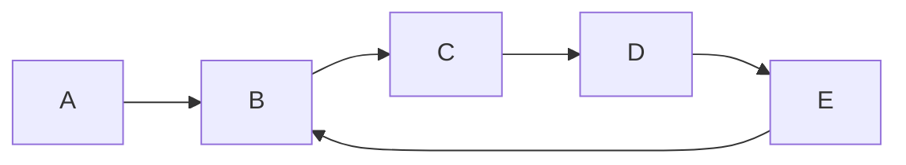

# Tarjan's Algorithm

tags: #algorithms #tarjan_algoritm #graph #cycle_detection #DFS

## References

- [geeksforgeeks](https://www.geeksforgeeks.org/tarjan-algorithm-find-strongly-connected-components/)
- chatGPT

## Strongly Connected Components (SCCs)

In a directed graph, a strongly connected component is a subset of vertices where every vertex in the subset is reachable from every other vertex in the subset.



## Algorithm Overview

Tarjan's algorithm is based on [[Depth-First Search]] and uses a concept called the "low-link value" to identify strongly connected components. The algorithm works as follows:

1. Initialize an empty stack and a counter to keep track of the number of visited vertices.
2. Start a DFS traversal from an unvisited vertex in the graph.
3. Assign a unique index to each visited vertex and set its low-link value equal to its index.
4. Push the visited vertex onto the stack.
5. For each neighbor of the current vertex:
   - If the neighbor is not visited, recursively traverse it and update the low-link value of the current vertex based on the minimum of its own low-link value and the low-link value of the neighbor.
   - If the neighbor is on the stack, update the low-link value of the current vertex based on the minimum of its own low-link value and the index of the neighbor.
6. If the low-link value of the current vertex is equal to its index, it means we have found a strongly connected component. Pop vertices from the stack until the current vertex is reached, and these popped vertices form a strongly connected component.
7. Repeat steps 2-6 for all unvisited vertices in the graph.

## Example Implementation in Go

Here's an example implementation of Tarjan's algorithm in Go:

```go
package main

import "fmt"

type Graph struct {
    vertices int
    adjacency map[int][]int
}

func (g *Graph) Tarjan() [][]int {
    var index, count int
    var stack []int
    var visited, onStack []bool
    var lowLink, ids []int
    var result [][]int

    index = 0
    count = 0
    stack = make([]int, 0)
    visited = make([]bool, g.vertices)
    onStack = make([]bool, g.vertices)
    lowLink = make([]int, g.vertices)
    ids = make([]int, g.vertices)

    for i := 0; i < g.vertices; i++ {
        if !visited[i] {
            g.tarjanDFS(i, &index, &count, &stack, &visited, &onStack, &lowLink, &ids, &result)
        }
    }

    return result
}

func (g *Graph) tarjanDFS(vertex int, index, count *int, stack *[]int, visited, onStack *[]bool, lowLink, ids *[]int, result *[][]int) {
    (*lowLink)[vertex] = *index
    (*ids)[vertex] = *index
    *index++
    (*stack) = append((*stack), vertex)
    (*visited)[vertex] = true
    (*onStack)[vertex] = true

    for _, neighbor := range g.adjacency[vertex] {
        if !(*visited)[neighbor] {
            g.tarjanDFS(neighbor, index, count, stack, visited, onStack, lowLink, ids, result)
            (*lowLink)[vertex] = min((*lowLink)[vertex], (*lowLink)[neighbor])
        } else if (*onStack)[neighbor] {
            (*lowLink)[vertex] = min((*lowLink)[vertex], (*ids)[neighbor])
        }
    }

    if (*lowLink)[vertex] == (*ids)[vertex] {
        var component []int
        for {
            node := (*stack)[len(*stack)-1]
            (*stack) = (*stack)[:len(*stack)-1]
            (*onStack)[node] = false
            component = append(component, node)
            if node == vertex {
                break
            }
        }
        (*result) = append((*result), component)
        *count++
    }
}

func min(a, b int) int {
    if a < b {
        return a
    }
    return b
}

func main() {
    // Example usage
    graph := Graph{
        vertices: 5,
        adjacency: map[int][]int{
            0: {1},
            1: {2},
            2: {0, 3},
            3: {4},
            4: {2, 3},
        },
    }

    components := graph.Tarjan()
    fmt.Println("Strongly Connected Components:")
    for _, component := range components {
        fmt.Println(component)
    }
}
```

In this example, we define a `Graph` struct with the number of vertices and an adjacency map representing the graph's edges. The `Tarjan()` function performs the Tarjan's algorithm, and the `tarjanDFS()` function is a helper function that performs the DFS traversal and updates the low-link values. The algorithm returns a 2D slice containing the strongly connected components found in the graph.

## Conclusion

Tarjan's algorithm is an efficient method for finding strongly connected components in a directed graph. It can be applied to various graph-related problems and has a time complexity of O(V + E), where V is the number of vertices and E is the number of edges in the graph. By utilizing the low-link values and a stack, Tarjan's algorithm provides a powerful approach to solve graph connectivity problems.
