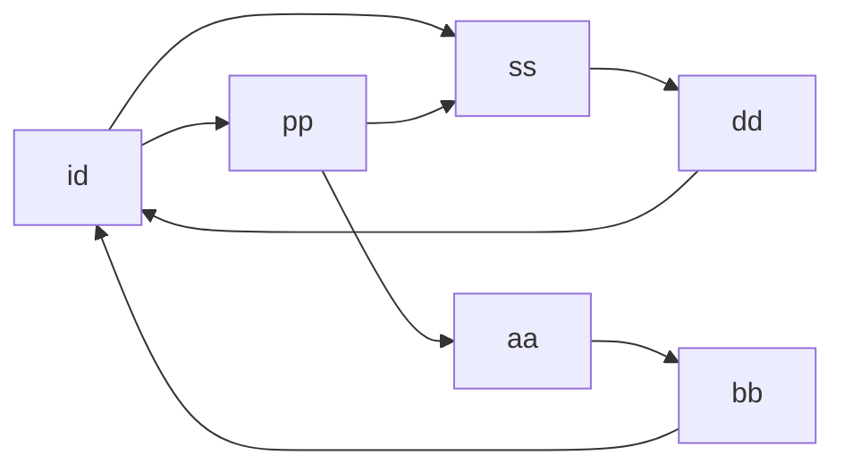
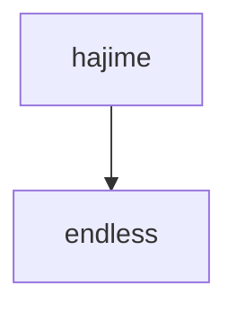
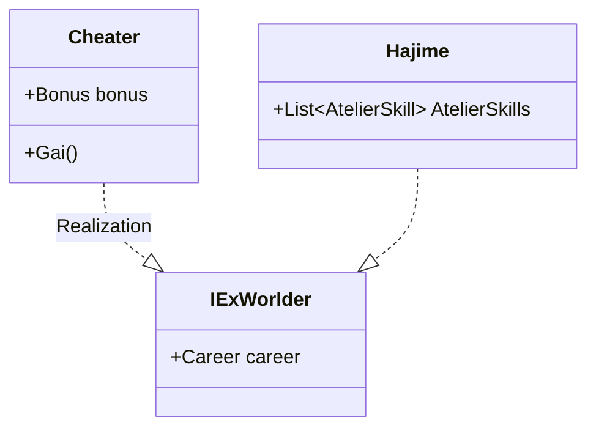

# Mermaid

#markdown #mermaid #uml


參考文件: https://mermaid-js.github.io/mermaid/#/






```mermaid
gitGraph:
commit
commit
commit
branch ss
checkout ss
commit
commit
checkout master
commit
merge ss

```



